# 📚 Documentación Completa — Delivereats (Fase 1)

## Proyecto - Software Avanzado A

**Universidad de San Carlos de Guatemala**
**Facultad de Ingeniería**
**Escuela de Ciencias y Sistemas**

| Dato | Valor |
|------|-------|
| **Nombre** | José Alberto Alarcón Chigua |
| **Carné** | 201346084 |
| **Curso** | Software Avanzado A |
| **Catedráticos** | Everest Darwin Medinilla Rodríguez / Juan Pablo Samayoa Ruiz |
| **Semestre** | 1er Semestre 2026 |

---

## 📋 Tabla de Contenidos

1. [Introducción](#1-introducción)
2. [Requerimientos Funcionales](#2-requerimientos-funcionales)
3. [Requerimientos No Funcionales](#3-requerimientos-no-funcionales)
4. [Arquitectura del Sistema](#4-arquitectura-del-sistema)
5. [Diagrama de Componentes](#5-diagrama-de-componentes)
6. [Diagrama de Despliegue](#6-diagrama-de-despliegue)
7. [Diagramas de Secuencia](#7-diagramas-de-secuencia)
8. [Diagrama de Estados — Ciclo de Vida de una Orden](#8-diagrama-de-estados--ciclo-de-vida-de-una-orden)
9. [Modelo Entidad-Relación](#9-modelo-entidad-relación)
10. [Diagrama de Clases — Protobuf Messages](#10-diagrama-de-clases--protobuf-messages)
11. [Diagrama de Paquetes — Estructura del Proyecto](#11-diagrama-de-paquetes--estructura-del-proyecto)
12. [Endpoints REST (API Gateway)](#12-endpoints-rest-api-gateway)
13. [Contratos gRPC (Protobuf)](#13-contratos-grpc-protobuf)
14. [Notificaciones por Correo](#14-notificaciones-por-correo)
15. [Decisiones Técnicas](#15-decisiones-técnicas)
16. [Despliegue en GCP](#16-despliegue-en-gcp)

---

## 1. Introducción

### 1.1 Descripción del Proyecto

**Delivereats** es una plataforma de entrega de alimentos tipo delivery diseñada bajo una **arquitectura de microservicios**. La aplicación permite a los usuarios registrarse, iniciar sesión, explorar restaurantes, consultar menús, generar pedidos y gestionar entregas, con notificaciones por correo electrónico en cada etapa del proceso.

### 1.2 Objetivos

- Implementar una arquitectura de microservicios con 6 servicios independientes
- Utilizar gRPC como protocolo de comunicación entre microservicios
- Exponer una API REST a través de un API Gateway centralizado
- Gestionar autenticación y autorización con JWT y roles
- Implementar notificaciones por correo electrónico (SMTP)
- Dockerizar todos los componentes y desplegar en Google Cloud Platform

### 1.3 Alcance — Microservicios Implementados

| # | Microservicio | Responsabilidad |
|---|---------------|-----------------|
| 1 | API Gateway | Punto de entrada REST, validación JWT, autorización por roles |
| 2 | Auth Service | Registro, login, generación y validación de JWT |
| 3 | Restaurant Catalog Service | CRUD de restaurantes y menús |
| 4 | Order Service | Creación, estados y gestión de órdenes |
| 5 | Delivery Service | Asignación de repartidores y gestión de entregas |
| 6 | Notification Service | Notificaciones por correo electrónico |

### 1.4 Stack Tecnológico

| Componente | Tecnología |
|-----------|------------|
| **Frontend** | React 18 + Vite |
| **API Gateway** | Node.js + Express |
| **Microservicios** | Node.js + gRPC (protobuf) |
| **Base de Datos** | PostgreSQL 15 (embebida por servicio) |
| **Autenticación** | JWT + bcrypt |
| **Comunicación** | REST (frontend ↔ gateway) · gRPC (gateway ↔ servicios) |
| **Contenedores** | Docker + Docker Compose |
| **Nube** | Google Cloud Platform (Compute Engine) |
| **Email** | Nodemailer (SMTP Gmail) |

---

## 2. Requerimientos Funcionales

### 2.1 Módulo de Autenticación (Auth Service)

| ID | Requerimiento | Descripción | Estado |
|----|---------------|-------------|--------|
| RF-AUTH-01 | Registro de usuarios | Registro con email, contraseña, nombre y rol (CLIENTE, RESTAURANTE, REPARTIDOR, ADMINISTRADOR) | ✅ |
| RF-AUTH-02 | Inicio de sesión | Autenticación mediante email y contraseña con generación de JWT | ✅ |
| RF-AUTH-03 | Gestión de roles | Soporte para 4 roles: CLIENTE, RESTAURANTE, REPARTIDOR, ADMINISTRADOR | ✅ |
| RF-AUTH-04 | Validación de JWT | Validación de tokens en cada petición protegida | ✅ |
| RF-AUTH-05 | Encriptación | Contraseñas almacenadas con bcrypt (hash + salt) | ✅ |
| RF-AUTH-06 | Listado de usuarios | El administrador puede listar todos los usuarios registrados | ✅ |

### 2.2 Módulo de Catálogo (Restaurant Catalog Service)

| ID | Requerimiento | Descripción | Estado |
|----|---------------|-------------|--------|
| RF-CAT-01 | CRUD de restaurantes | Crear, listar, actualizar y eliminar restaurantes (ADMINISTRADOR) | ✅ |
| RF-CAT-02 | CRUD de menú | Crear, listar, actualizar y eliminar ítems de menú (RESTAURANTE) | ✅ |
| RF-CAT-03 | Listado de restaurantes | Los clientes pueden ver restaurantes disponibles | ✅ |
| RF-CAT-04 | Listado de menú | Los clientes pueden ver el menú de un restaurante | ✅ |
| RF-CAT-05 | Datos del restaurante | Nombre, dirección, teléfono, horario, tipo de comida | ✅ |
| RF-CAT-06 | Datos del ítem | Nombre, descripción, precio, disponibilidad, categoría | ✅ |

### 2.3 Módulo de Órdenes (Order Service)

| ID | Requerimiento | Descripción | Estado |
|----|---------------|-------------|--------|
| RF-ORD-01 | Crear orden | El cliente selecciona productos y crea una orden | ✅ |
| RF-ORD-02 | Recibir orden | El restaurante visualiza órdenes y las pone EN_PROCESO | ✅ |
| RF-ORD-03 | Finalizar orden | El restaurante marca la orden como LISTA | ✅ |
| RF-ORD-04 | Cancelar orden (cliente) | El cliente puede cancelar su orden → estado CANCELADA | ✅ |
| RF-ORD-05 | Cancelar orden (restaurante) | El restaurante puede cancelar → estado CANCELADA | ✅ |
| RF-ORD-06 | Rechazar orden | El restaurante puede rechazar → estado RECHAZADA | ✅ |
| RF-ORD-07 | Historial del cliente | El cliente puede ver sus órdenes | ✅ |
| RF-ORD-08 | Órdenes del restaurante | El restaurante puede ver sus órdenes recibidas | ✅ |
| RF-ORD-09 | Listado general | El administrador puede ver todas las órdenes | ✅ |

### 2.4 Módulo de Entregas (Delivery Service)

| ID | Requerimiento | Descripción | Estado |
|----|---------------|-------------|--------|
| RF-DEL-01 | Aceptar pedido | El repartidor acepta una orden LISTA → pasa a EN_CAMINO | ✅ |
| RF-DEL-02 | Actualizar entrega | El repartidor actualiza estado a ENTREGADA o CANCELADA | ✅ |
| RF-DEL-03 | Órdenes disponibles | El repartidor puede ver órdenes LISTA disponibles | ✅ |
| RF-DEL-04 | Historial de entregas | El repartidor puede ver sus entregas realizadas | ✅ |

### 2.5 Módulo de Notificaciones (Notification Service)

| ID | Requerimiento | Descripción | Estado |
|----|---------------|-------------|--------|
| RF-NOT-01 | Orden creada | Correo al cliente con resumen del pedido | ✅ |
| RF-NOT-02 | Orden cancelada (cliente) | Correo al cliente confirmando cancelación | ✅ |
| RF-NOT-03 | Orden en camino | Correo al cliente con datos del repartidor | ✅ |
| RF-NOT-04 | Orden cancelada (restaurante) | Correo al cliente por cancelación del restaurante | ✅ |
| RF-NOT-05 | Orden cancelada (repartidor) | Correo al cliente por cancelación del repartidor | ✅ |
| RF-NOT-06 | Orden rechazada | Correo al cliente por rechazo del restaurante | ✅ |

---

## 3. Requerimientos No Funcionales

### 3.1 Seguridad

| ID | Requerimiento | Implementación |
|----|---------------|----------------|
| RNF-SEG-01 | Autenticación JWT | Tokens con expiración de 24h, firmados con secret |
| RNF-SEG-02 | Encriptación de contraseñas | bcrypt con salt rounds |
| RNF-SEG-03 | Autorización por roles | Middleware en API Gateway verifica rol del token |
| RNF-SEG-04 | Validación de entrada | Validación en frontend y en servicios |

### 3.2 Escalabilidad

| ID | Requerimiento | Implementación |
|----|---------------|----------------|
| RNF-ESC-01 | Microservicios independientes | 6 servicios desacoplados con su propia BD |
| RNF-ESC-02 | Contenedorización | Docker para cada servicio |
| RNF-ESC-03 | Orquestación | Docker Compose para despliegue |
| RNF-ESC-04 | Base de datos por servicio | PostgreSQL embebido e independiente |

### 3.3 Disponibilidad

| ID | Requerimiento | Implementación |
|----|---------------|----------------|
| RNF-DISP-01 | Despliegue en nube | Google Cloud Platform (Compute Engine) |
| RNF-DISP-02 | Persistencia de datos | Volúmenes Docker para datos de PostgreSQL |
| RNF-DISP-03 | Reinicio automático | `restart: unless-stopped` en docker-compose |

### 3.4 Mantenibilidad

| ID | Requerimiento | Implementación |
|----|---------------|----------------|
| RNF-MANT-01 | Contratos estrictos | Protocol Buffers (.proto) para interfaces gRPC |
| RNF-MANT-02 | Inyección de dependencias | Contenedor DI en cada microservicio |
| RNF-MANT-03 | Código documentado | README.md + docs/DOCUMENTACION.md |
| RNF-MANT-04 | Versionamiento | Git + Tag semántico (v1.0.0) |

---

## 4. Arquitectura del Sistema

### 4.1 Descripción General

La aplicación sigue una **arquitectura de microservicios** con el patrón **Database per Service**. El frontend se comunica con el API Gateway vía REST, y el API Gateway enruta las peticiones a los microservicios internos vía gRPC.

### 4.2 Diagrama de Arquitectura de Alto Nivel

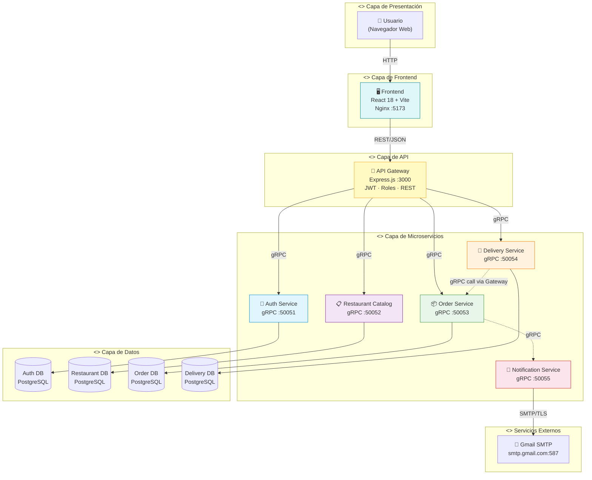

### 4.3 Flujo General de Comunicación

```
[Navegador] ──REST/JSON──▶ [API Gateway :3000]
                                   │
                    ┌──────────────┼──────────────┬──────────────┐
                    │ gRPC         │ gRPC         │ gRPC         │ gRPC
                    ▼              ▼              ▼              ▼
              [Auth :50051]  [Catalog :50052] [Order :50053] [Delivery :50054]
                    │              │              │              │
                    ▼              ▼              ▼              ▼
              [Auth DB]      [Rest DB]       [Order DB]     [Deliv DB]
                                                │
                                                │ gRPC
                                                ▼
                                        [Notification :50055]
                                                │
                                                │ SMTP
                                                ▼
                                          [Gmail SMTP]
```

---

## 5. Diagrama de Componentes

### 5.1 Componentes del Sistema (UML)

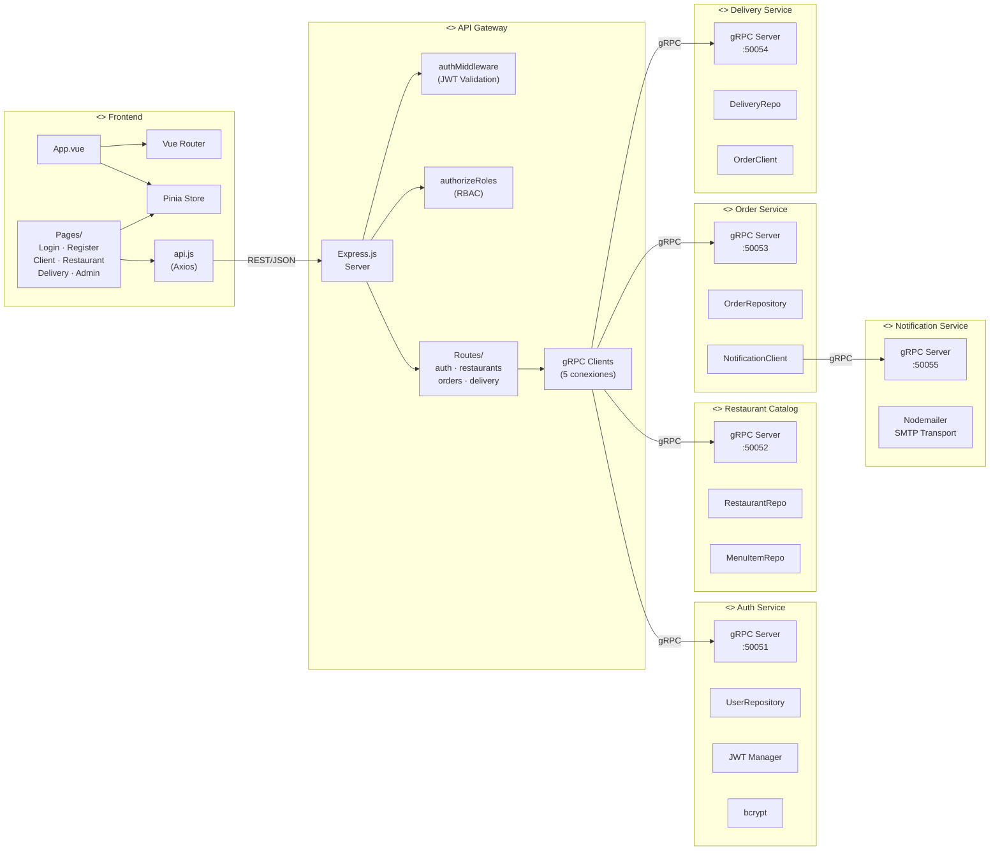

### 5.2 Interfaces Proporcionadas por cada Servicio

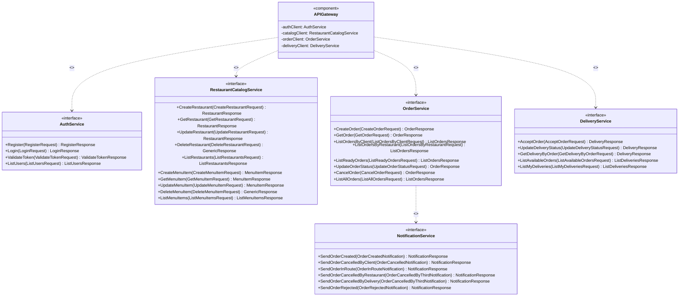

---

## 6. Diagrama de Despliegue

### 6.1 Despliegue en GCP (UML)

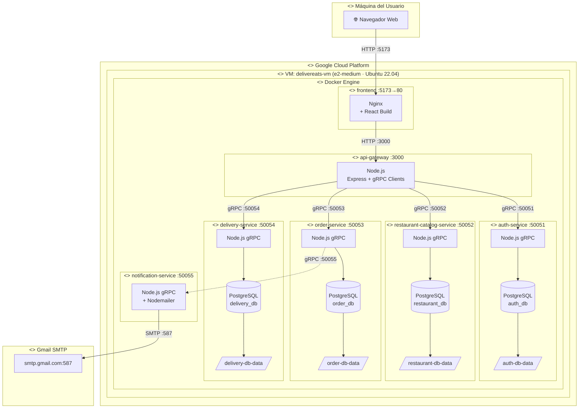

### 6.2 Información del Despliegue

| Recurso | Detalle |
|---------|---------|
| **Proyecto GCP** | `usac-sa-201346084` |
| **VM** | `delivereats-vm` |
| **Zona** | `us-central1-a` |
| **Tipo** | `e2-medium` (2 vCPU, 4 GB RAM) |
| **SO** | Ubuntu 22.04 LTS |
| **IP externa** | `34.57.204.245` |
| **Frontend** | http://34.57.204.245:5173 |
| **API Gateway** | http://34.57.204.245:3000/api |

---

## 7. Diagramas de Secuencia

### 7.1 Registro de Usuario

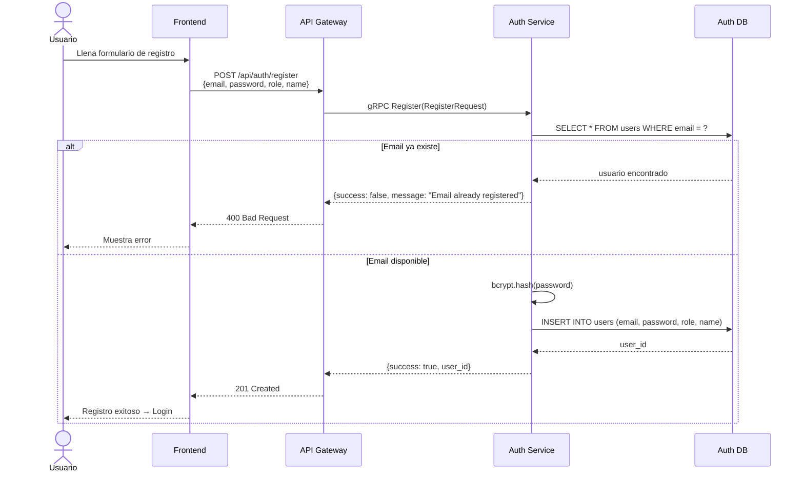

### 7.2 Inicio de Sesión (Login)

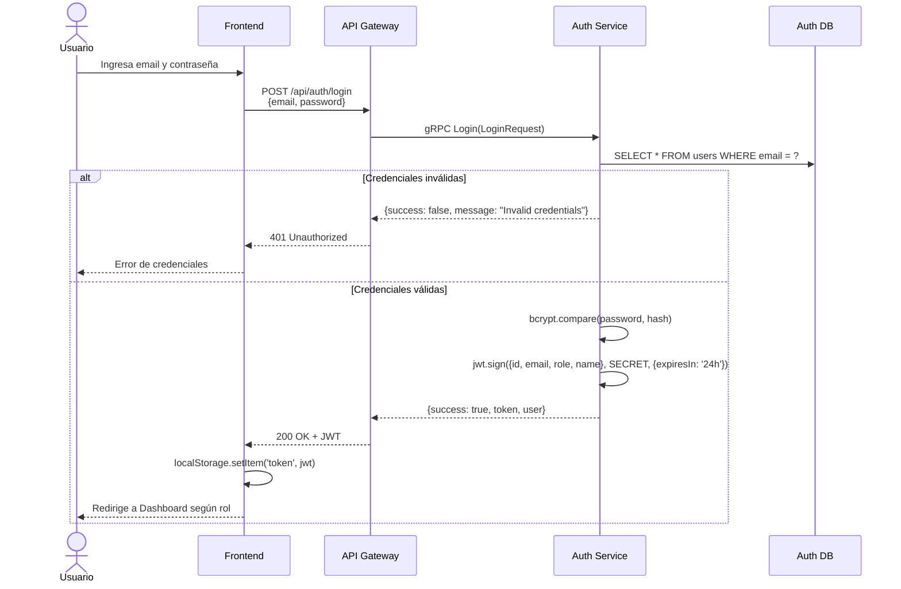

### 7.3 Crear Orden (Flujo Completo con Notificación)

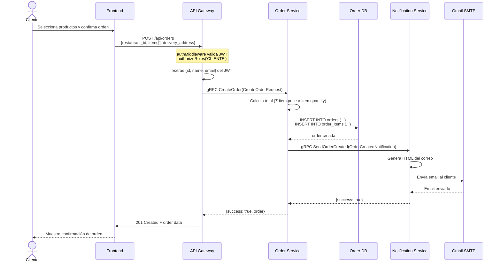

### 7.4 Flujo Completo de una Orden (Creación → Entrega)

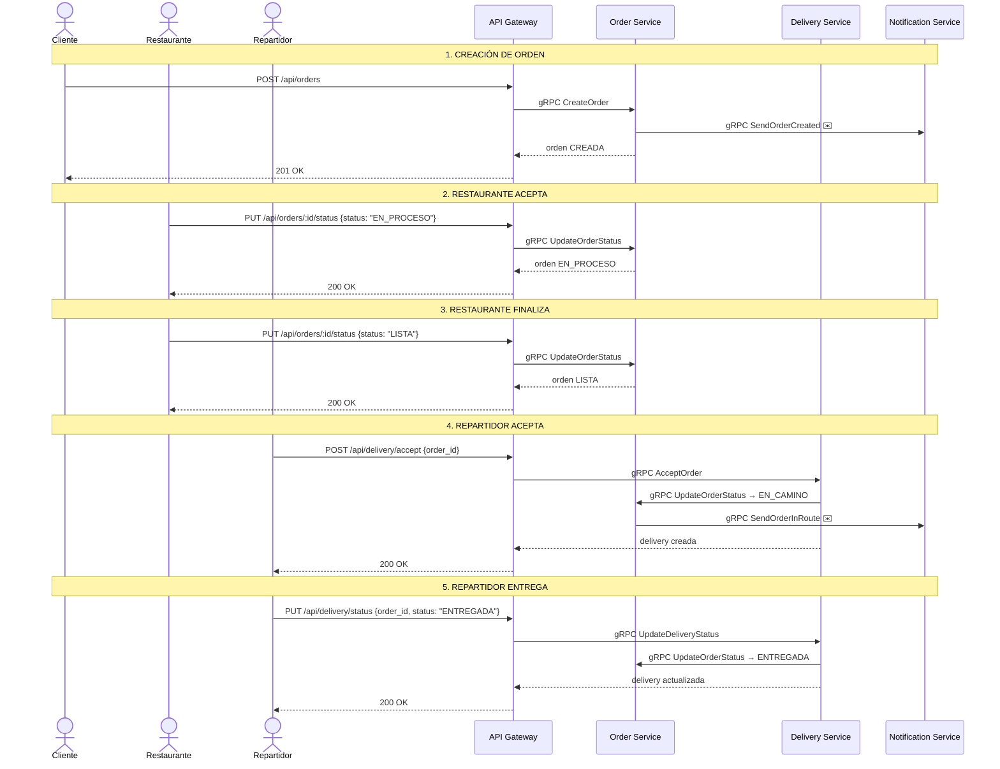

### 7.5 Cancelación de Orden por Restaurante

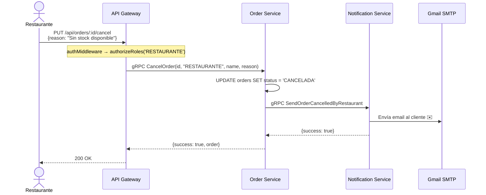

### 7.6 Rechazo de Orden

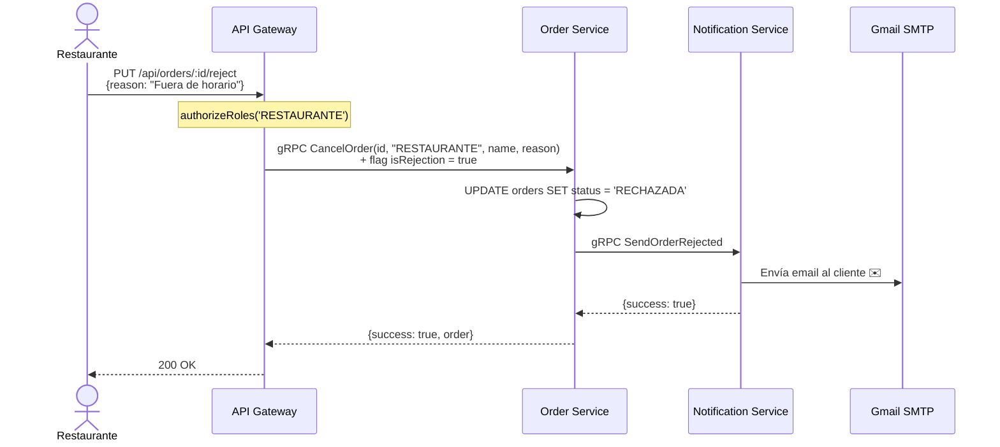

### 7.7 Validación de JWT en cada Request

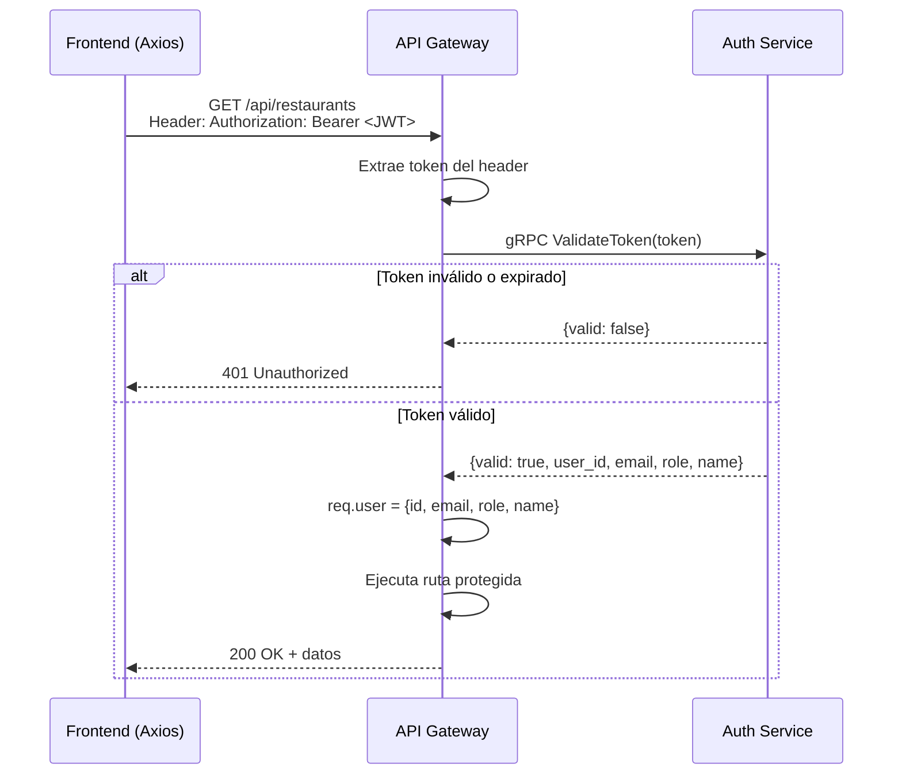

---

## 8. Diagrama de Estados — Ciclo de Vida de una Orden

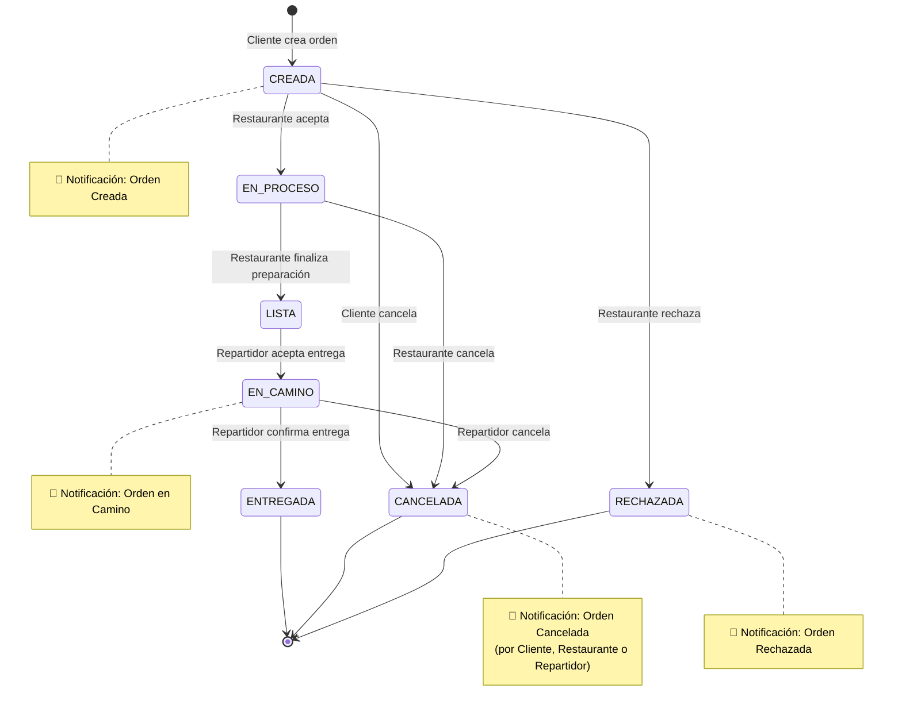

### Tabla de Transiciones de Estado

| Estado Origen | Estado Destino | Acción | Actor | Notificación |
|---------------|----------------|--------|-------|-------------|
| — | CREADA | Crear orden | CLIENTE | ✉️ Orden creada |
| CREADA | EN_PROCESO | Aceptar orden | RESTAURANTE | — |
| CREADA | CANCELADA | Cancelar orden | CLIENTE | ✉️ Cancelada (cliente) |
| CREADA | RECHAZADA | Rechazar orden | RESTAURANTE | ✉️ Orden rechazada |
| EN_PROCESO | LISTA | Finalizar preparación | RESTAURANTE | — |
| EN_PROCESO | CANCELADA | Cancelar orden | RESTAURANTE | ✉️ Cancelada (restaurante) |
| LISTA | EN_CAMINO | Aceptar entrega | REPARTIDOR | ✉️ Orden en camino |
| EN_CAMINO | ENTREGADA | Confirmar entrega | REPARTIDOR | — |
| EN_CAMINO | CANCELADA | Cancelar entrega | REPARTIDOR | ✉️ Cancelada (repartidor) |

---

## 9. Modelo Entidad-Relación

### 9.1 Distribución de Bases de Datos

| Base de Datos | Servicio | Tablas | Volumen Docker |
|---------------|----------|--------|----------------|
| `auth_db` | Auth Service | users | auth-db-data |
| `restaurant_db` | Restaurant Catalog | restaurants, menu_items | restaurant-db-data |
| `order_db` | Order Service | orders, order_items | order-db-data |
| `delivery_db` | Delivery Service | deliveries | delivery-db-data |

> **Nota:** Cada servicio administra su propia base de datos de forma independiente (patrón Database per Service). No existen foreign keys entre bases de datos; la integridad referencial entre servicios se mantiene a nivel aplicación.

### 9.2 Diagrama ER (Mermaid)

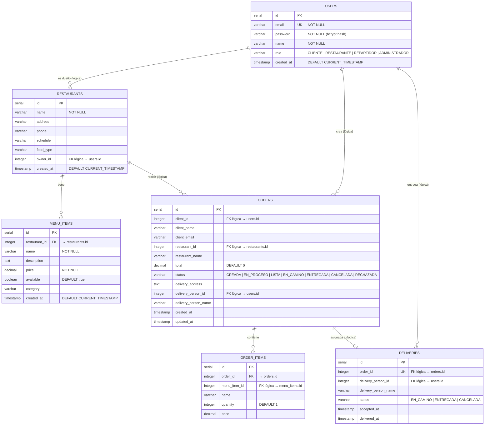

### 9.3 SQL de los Esquemas

<details>
<summary><strong>Auth DB — users</strong></summary>

```sql
CREATE TABLE users (
  id SERIAL PRIMARY KEY,
  email VARCHAR(255) UNIQUE NOT NULL,
  password VARCHAR(255) NOT NULL,
  name VARCHAR(255) NOT NULL,
  role VARCHAR(50) NOT NULL,
  created_at TIMESTAMP DEFAULT CURRENT_TIMESTAMP
);
```
</details>

<details>
<summary><strong>Restaurant DB — restaurants + menu_items</strong></summary>

```sql
CREATE TABLE restaurants (
  id SERIAL PRIMARY KEY,
  name VARCHAR(255) NOT NULL,
  address VARCHAR(500),
  phone VARCHAR(50),
  schedule VARCHAR(255),
  food_type VARCHAR(100),
  owner_id INTEGER NOT NULL,
  created_at TIMESTAMP DEFAULT CURRENT_TIMESTAMP
);

CREATE TABLE menu_items (
  id SERIAL PRIMARY KEY,
  restaurant_id INTEGER REFERENCES restaurants(id) ON DELETE CASCADE,
  name VARCHAR(255) NOT NULL,
  description TEXT,
  price DECIMAL(10, 2) NOT NULL,
  available BOOLEAN DEFAULT true,
  category VARCHAR(100),
  created_at TIMESTAMP DEFAULT CURRENT_TIMESTAMP
);
```
</details>

<details>
<summary><strong>Order DB — orders + order_items</strong></summary>

```sql
CREATE TABLE orders (
  id SERIAL PRIMARY KEY,
  client_id INTEGER NOT NULL,
  client_name VARCHAR(255),
  client_email VARCHAR(255),
  restaurant_id INTEGER NOT NULL,
  restaurant_name VARCHAR(255),
  total DECIMAL(10, 2) DEFAULT 0,
  status VARCHAR(50) DEFAULT 'CREADA',
  delivery_address TEXT,
  delivery_person_id INTEGER,
  delivery_person_name VARCHAR(255),
  created_at TIMESTAMP DEFAULT CURRENT_TIMESTAMP,
  updated_at TIMESTAMP DEFAULT CURRENT_TIMESTAMP
);

CREATE TABLE order_items (
  id SERIAL PRIMARY KEY,
  order_id INTEGER REFERENCES orders(id) ON DELETE CASCADE,
  menu_item_id INTEGER,
  name VARCHAR(255),
  quantity INTEGER DEFAULT 1,
  price DECIMAL(10, 2)
);
```
</details>

<details>
<summary><strong>Delivery DB — deliveries</strong></summary>

```sql
CREATE TABLE deliveries (
  id SERIAL PRIMARY KEY,
  order_id INTEGER UNIQUE NOT NULL,
  delivery_person_id INTEGER NOT NULL,
  delivery_person_name VARCHAR(255),
  status VARCHAR(50) DEFAULT 'EN_CAMINO',
  accepted_at TIMESTAMP DEFAULT CURRENT_TIMESTAMP,
  delivered_at TIMESTAMP
);
```
</details>

---

## 10. Diagrama de Clases — Protobuf Messages

### 10.1 Auth Service Messages

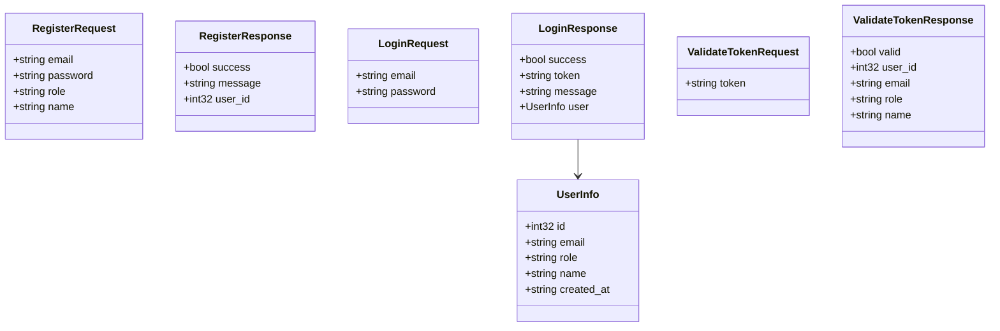

### 10.2 Order & Delivery Messages

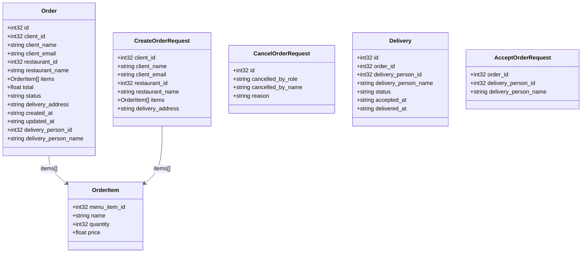

### 10.3 Notification Messages

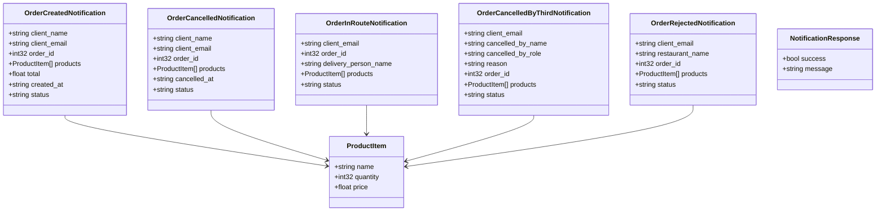

---

## 11. Diagrama de Paquetes — Estructura del Proyecto

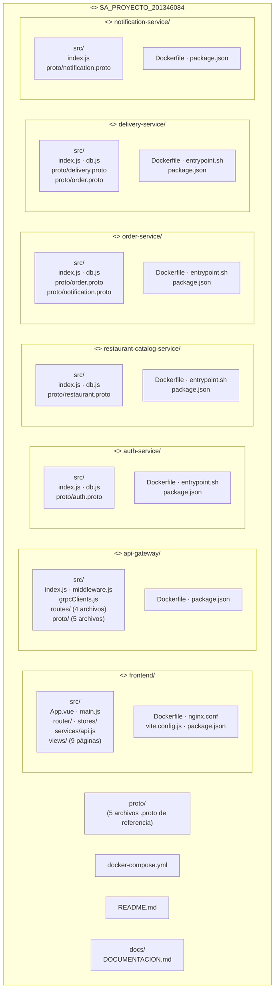

---

## 12. Endpoints REST (API Gateway)

### 12.1 Autenticación

| Método | Ruta | Descripción | Auth | Roles |
|--------|------|-------------|------|-------|
| `POST` | `/api/auth/register` | Registro de usuario | ❌ | Público |
| `POST` | `/api/auth/login` | Inicio de sesión | ❌ | Público |
| `GET` | `/api/auth/users` | Listar usuarios | ✅ | ADMINISTRADOR |

### 12.2 Restaurantes y Menú

| Método | Ruta | Descripción | Auth | Roles |
|--------|------|-------------|------|-------|
| `GET` | `/api/restaurants` | Listar restaurantes | ✅ | Cualquiera |
| `GET` | `/api/restaurants/:id` | Detalle de restaurante | ✅ | Cualquiera |
| `POST` | `/api/restaurants` | Crear restaurante | ✅ | ADMINISTRADOR |
| `PUT` | `/api/restaurants/:id` | Actualizar restaurante | ✅ | ADMINISTRADOR |
| `DELETE` | `/api/restaurants/:id` | Eliminar restaurante | ✅ | ADMINISTRADOR |
| `GET` | `/api/restaurants/:id/menu` | Ver menú | ✅ | Cualquiera |
| `POST` | `/api/restaurants/:id/menu` | Crear producto | ✅ | RESTAURANTE |
| `PUT` | `/api/restaurants/menu/:itemId` | Actualizar producto | ✅ | RESTAURANTE |
| `DELETE` | `/api/restaurants/menu/:itemId` | Eliminar producto | ✅ | RESTAURANTE |

### 12.3 Órdenes

| Método | Ruta | Descripción | Auth | Roles |
|--------|------|-------------|------|-------|
| `POST` | `/api/orders` | Crear orden | ✅ | CLIENTE |
| `GET` | `/api/orders/my` | Mis órdenes | ✅ | CLIENTE |
| `GET` | `/api/orders/restaurant/:id` | Órdenes del restaurante | ✅ | RESTAURANTE |
| `GET` | `/api/orders/ready` | Órdenes listas | ✅ | REPARTIDOR |
| `GET` | `/api/orders/all` | Todas las órdenes | ✅ | ADMINISTRADOR |
| `GET` | `/api/orders/:id` | Detalle de orden | ✅ | Cualquiera |
| `PUT` | `/api/orders/:id/status` | Actualizar estado | ✅ | RESTAURANTE |
| `PUT` | `/api/orders/:id/cancel` | Cancelar orden | ✅ | CLIENTE, RESTAURANTE, REPARTIDOR |
| `PUT` | `/api/orders/:id/reject` | Rechazar orden | ✅ | RESTAURANTE |

### 12.4 Delivery

| Método | Ruta | Descripción | Auth | Roles |
|--------|------|-------------|------|-------|
| `POST` | `/api/delivery/accept` | Aceptar pedido | ✅ | REPARTIDOR |
| `PUT` | `/api/delivery/status` | Actualizar estado de entrega | ✅ | REPARTIDOR |
| `GET` | `/api/delivery/available` | Órdenes disponibles | ✅ | REPARTIDOR |
| `GET` | `/api/delivery/my` | Mis entregas | ✅ | REPARTIDOR |

---

## 13. Contratos gRPC (Protobuf)

### 13.1 AuthService (auth.proto)

| RPC | Request | Response | Descripción |
|-----|---------|----------|-------------|
| `Register` | RegisterRequest | RegisterResponse | Registro de usuario |
| `Login` | LoginRequest | LoginResponse | Login + generación de JWT |
| `ValidateToken` | ValidateTokenRequest | ValidateTokenResponse | Validar JWT |
| `ListUsers` | ListUsersRequest | ListUsersResponse | Listar usuarios (admin) |

### 13.2 RestaurantCatalogService (restaurant.proto)

| RPC | Request | Response | Descripción |
|-----|---------|----------|-------------|
| `CreateRestaurant` | CreateRestaurantRequest | RestaurantResponse | Crear restaurante |
| `GetRestaurant` | GetRestaurantRequest | RestaurantResponse | Obtener restaurante |
| `UpdateRestaurant` | UpdateRestaurantRequest | RestaurantResponse | Actualizar restaurante |
| `DeleteRestaurant` | DeleteRestaurantRequest | GenericResponse | Eliminar restaurante |
| `ListRestaurants` | ListRestaurantsRequest | ListRestaurantsResponse | Listar todos |
| `CreateMenuItem` | CreateMenuItemRequest | MenuItemResponse | Crear ítem de menú |
| `GetMenuItem` | GetMenuItemRequest | MenuItemResponse | Obtener ítem |
| `UpdateMenuItem` | UpdateMenuItemRequest | MenuItemResponse | Actualizar ítem |
| `DeleteMenuItem` | DeleteMenuItemRequest | GenericResponse | Eliminar ítem |
| `ListMenuItems` | ListMenuItemsRequest | ListMenuItemsResponse | Listar menú |

### 13.3 OrderService (order.proto)

| RPC | Request | Response | Descripción |
|-----|---------|----------|-------------|
| `CreateOrder` | CreateOrderRequest | OrderResponse | Crear orden |
| `GetOrder` | GetOrderRequest | OrderResponse | Detalle de orden |
| `ListOrdersByClient` | ListOrdersByClientRequest | ListOrdersResponse | Órdenes del cliente |
| `ListOrdersByRestaurant` | ListOrdersByRestaurantRequest | ListOrdersResponse | Órdenes del restaurante |
| `ListReadyOrders` | ListReadyOrdersRequest | ListOrdersResponse | Órdenes listas |
| `UpdateOrderStatus` | UpdateOrderStatusRequest | OrderResponse | Actualizar estado |
| `CancelOrder` | CancelOrderRequest | OrderResponse | Cancelar orden |
| `ListAllOrders` | ListAllOrdersRequest | ListOrdersResponse | Todas las órdenes |

### 13.4 DeliveryService (delivery.proto)

| RPC | Request | Response | Descripción |
|-----|---------|----------|-------------|
| `AcceptOrder` | AcceptOrderRequest | DeliveryResponse | Aceptar entrega |
| `UpdateDeliveryStatus` | UpdateDeliveryStatusRequest | DeliveryResponse | Actualizar estado |
| `GetDeliveryByOrder` | GetDeliveryByOrderRequest | DeliveryResponse | Consultar entrega |
| `ListAvailableOrders` | ListAvailableOrdersRequest | ListDeliveriesResponse | Órdenes disponibles |
| `ListMyDeliveries` | ListMyDeliveriesRequest | ListDeliveriesResponse | Mis entregas |

### 13.5 NotificationService (notification.proto)

| RPC | Request | Response | Trigger |
|-----|---------|----------|---------|
| `SendOrderCreated` | OrderCreatedNotification | NotificationResponse | Al crear orden |
| `SendOrderCancelledByClient` | OrderCancelledNotification | NotificationResponse | Cliente cancela |
| `SendOrderInRoute` | OrderInRouteNotification | NotificationResponse | Repartidor acepta |
| `SendOrderCancelledByRestaurant` | OrderCancelledByThirdNotification | NotificationResponse | Restaurante cancela |
| `SendOrderCancelledByDelivery` | OrderCancelledByThirdNotification | NotificationResponse | Repartidor cancela |
| `SendOrderRejected` | OrderRejectedNotification | NotificationResponse | Restaurante rechaza |

---

## 14. Notificaciones por Correo

### 14.1 Tipos de Notificación

| # | Evento | Destinatario | Contenido Mínimo |
|---|--------|-------------|-----------------|
| 1 | Orden creada | Cliente | Nombre, # orden, productos, total, fecha, estado (CREADA) |
| 2 | Orden cancelada (cliente) | Cliente | Nombre, productos, fecha cancelación, estado (CANCELADA) |
| 3 | Orden en camino | Cliente | # orden, nombre repartidor, productos, estado (EN_CAMINO) |
| 4 | Orden cancelada (restaurante) | Cliente | Nombre restaurante, razón, productos, estado (CANCELADA) |
| 5 | Orden cancelada (repartidor) | Cliente | Nombre repartidor, razón, productos, estado (CANCELADA) |
| 6 | Orden rechazada | Cliente | Nombre restaurante, # orden, productos, estado (RECHAZADA) |

### 14.2 Configuración SMTP

| Parámetro | Valor |
|-----------|-------|
| Host | `smtp.gmail.com` |
| Puerto | `587` |
| Seguridad | STARTTLS |
| Transporte | Nodemailer |

---

## 15. Decisiones Técnicas

### 15.1 PostgreSQL Embebido

Cada microservicio incluye PostgreSQL 15 **dentro de su propio contenedor Docker** (imagen base `postgres:15` combinada con Node.js). Esto garantiza total independencia de base de datos sin contenedores adicionales de BD, implementando el patrón **Database per Service** de forma estricta.

### 15.2 gRPC para Comunicación Interna

Se eligió **gRPC con Protocol Buffers** sobre REST para la comunicación entre microservicios por:
- Contratos estrictos definidos en archivos `.proto`
- Serialización binaria eficiente
- Tipado fuerte con generación automática de código
- Menor latencia vs JSON/REST

### 15.3 REST para el Frontend

El API Gateway expone endpoints **REST/JSON** que el frontend consume con **Axios**. Esto simplifica la integración con React y permite usar herramientas estándar de desarrollo web.

### 15.4 Roles y Autorización

La autorización se implementa con un middleware de dos capas:
1. `authMiddleware`: Valida el JWT llamando a `AuthService.ValidateToken` vía gRPC
2. `authorizeRoles(...)`: Verifica que el rol del usuario tenga acceso al endpoint

### 15.5 Docker Multi-Stage para Frontend

El frontend usa un **build multi-stage**: Vite compila la aplicación React en la etapa de build, y la etapa final sirve los archivos estáticos con **Nginx**, resultando en una imagen ligera.

### 15.6 GCP Compute Engine

Se eligió una **VM e2-medium** sobre servicios serverless (Cloud Run/GKE) por simplicidad de despliegue con Docker Compose, manteniendo la misma configuración en desarrollo y producción.

---

## 16. Despliegue en GCP

### 16.1 Pasos Realizados

1. Creación del proyecto GCP `usac-sa-201346084` con billing habilitado
2. Habilitación de la API de Compute Engine
3. Creación de VM `e2-medium` con Ubuntu 22.04 y Docker preinstalado
4. Configuración de reglas de firewall para puertos 80, 3000 y 5173
5. Copia del proyecto a la VM vía `gcloud compute scp`
6. Ejecución de `docker compose build && docker compose up -d`
7. Verificación de los 7 contenedores corriendo

### 16.2 URLs de Producción

| Servicio | URL |
|----------|-----|
| 🌐 Frontend | http://34.57.204.245:5173 |
| 🔌 API Gateway | http://34.57.204.245:3000/api |

### 16.3 Contenedores en Ejecución

| Contenedor | Imagen | Puerto | Volumen |
|-----------|--------|--------|---------|
| frontend | frontend:latest | 5173→80 | — |
| api-gateway | api-gateway:latest | 3000 | — |
| auth-service | auth-service:latest | 50051 | auth-db-data |
| restaurant-catalog-service | restaurant-catalog:latest | 50052 | restaurant-db-data |
| order-service | order-service:latest | 50053 | order-db-data |
| delivery-service | delivery-service:latest | 50054 | delivery-db-data |
| notification-service | notification-service:latest | 50055 | — |
